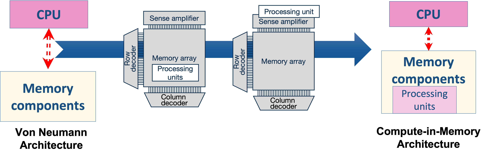
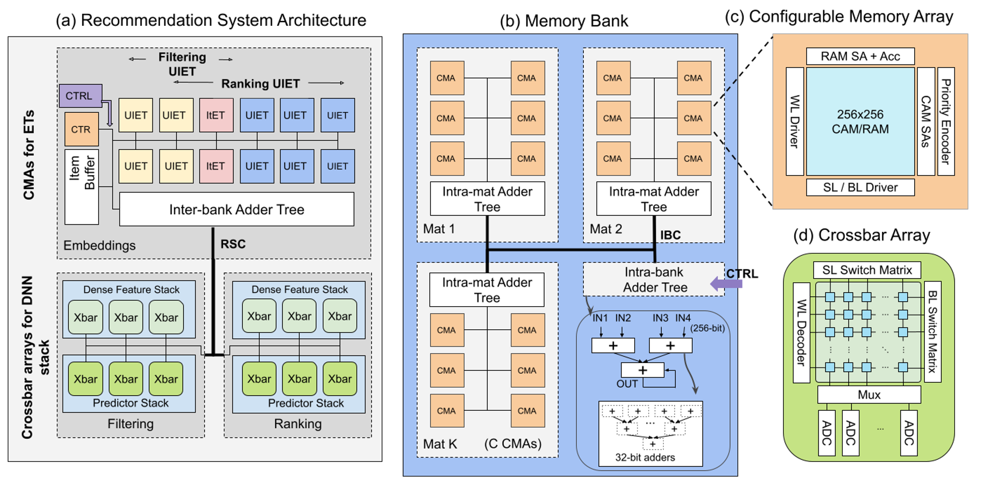

## **In-Memory-Computing Architecture for Memory Intensive Applications**

Data transfer between a processing element and memory in the traditional von Neumann architecture is becoming an ever-growing challenge due to emerging machine learning workloads and other data-centric applications. 

In-Memory-Computing (IMC) is an attractive architectural paradigm that moves the processing unit inside the memory. IMC shows excellent potential in reducing latency and energy consumption for most memory-intensive applications, especially for emerging machine learning workloads. I am exploiting the low power and latency IMC architecture through hardware and software exploration with my talented labmates.

On the hardware level, we are studying different memory elements that provide various computation capability, such as crossbar (matrix vector multiplication), content addressable memory (match/serach), general-purpose compute-in-memory circuit (basic boolean and arithmetric logic at the memory periphery). These memory elements provide great potential for designing a powerful IMC engine.

On the software level, we keep exploring potential powerful machine learning workloads, especially those that provide the potential for implementing intelligent edge AI systems. For now, I have worked with recommendation systems, reinforcement learning, and meta-learning algorithm.

 

From Von Neumann Architecture to Computing in Memory: moving processing unit into memory.

### **Representative papers**
Recommendation system

[1] **M. Li**, A. F. Laguna, D. Reis, X. Yin, M. Niemier, and X. Sharon Hu, DAC 2022 [link](https://arxiv.org/abs/2202.09433)

Memory replay technique for deep reinforcement learning:

[2] **M. Li**, A. Kazemi, A. F. Laguna, X. Sharon Hu, ICCAD 2022 [link](https://arxiv.org/abs/2207.07791)

Quantization technique exploration for on-chip training

[3] **M. Li**, X. Sharon Hu, DATE 2021 [link]((https://ieeexplore.ieee.org/document/9474037/metrics#metrics))

 

High-level Overview of an IMC Architecture for Recommendation System. We exploit the configurable memory array for fully in-memory embedding related operations. 

## **Low Power Circuit Design with Emerging Devices**
I am also interested in exploring the circuit design that exploits the unique features of beyond-CMOS devices. These work brought advances from the underlying hardware to practical circuit design. Thanks to the device experts I worked with.
### **Representative papers**
SRAM Cell Design

[1] P.Wu, **M. Li**, B. Zhou, X. Sharon Hu, and J. Appenzeller, TED 2022

Nonvolatile Multiplier Design

[2] **M. Li**, X. Yin, X. Sharon Hu, and C. Zhuo, ASPDAC 2020 

